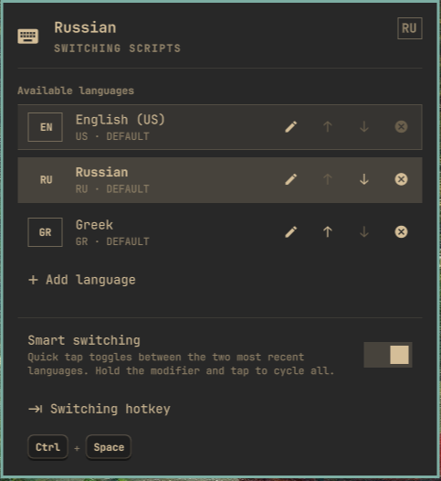
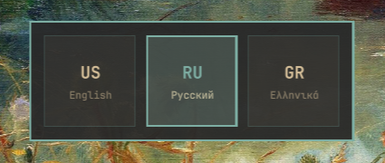
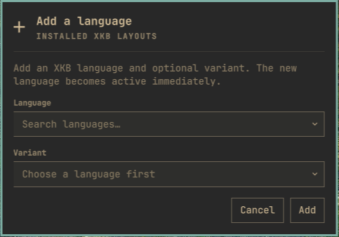
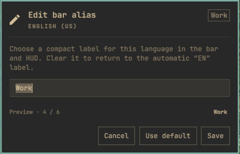
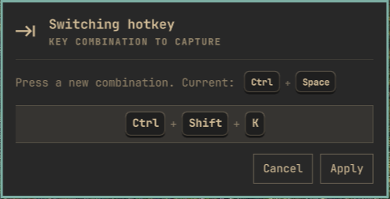

# Lingua

**Input-language switching that remembers what you actually use, plus a language manager in the [Omarchy](https://omarchy.org/) bar.**



Most Linux desktops walk through every layout in a fixed circle: US → Russian → Greek → US. If you mostly type in two languages, that means tapping twice to get back. Lingua switches the way macOS and GNOME do, and lets you manage the list without touching a config file.

- **Tap `Ctrl + Space`** to jump between the two languages you used last, however long ago that was.
- **Hold `Ctrl` and keep tapping `Space`** to walk through all of them, with a HUD that shows where you are.
- **Add, reorder, rename and remove languages** from a bar panel. Changes are validated, applied live and rolled back if Hyprland rejects them.
- **Cleans up after itself** when you disable or remove the plugin.

## Install

```bash
omarchy plugin add https://github.com/smyrnode/lingua.git --enable
omarchy plugin disable omarchy.keyboard-layout   # avoid two language labels in the bar
```

Or use **Omarchy Menu → Plugins**. On its first start the widget links the switcher and registers `Ctrl + Space`; see [what it sets up](#what-it-sets-up-outside-its-folder). Press the hotkey, or click the label in the bar.

### Requirements

`omarchy plugin add` only clones the repository: it installs no packages and runs no hooks. Lingua needs these commands:

| Command | Package | Needed for |
|---------|---------|------------|
| `jq` | `jq` | state handling (ships with Omarchy) |
| `xkbcli` | `libxkbcommon` | validating layouts and listing the catalog (ships with Hyprland) |
| `hyprctl` | `hyprland` | applying layouts live |
| `flock` | `util-linux` | serializing changes (part of the base system) |
| `python3` | `python` | the hotkey switcher `lingua-switch` |
| `fcitx5-remote` | `fcitx5` | optional: keeps fcitx5 input methods in step |

Only `python` may be missing on a fresh install: `omarchy pkg add python`. When something is missing, the language panel names the package to install.

## Using it

### Switching



| You do | What happens |
|--------|--------------|
| Tap `Ctrl + Space` | Toggle between the **last two** languages |
| Hold `Ctrl`, tap `Space` again within a second | Step through **all** languages; with three or more, a HUD shows the selection (bar aliases double as HUD names) |
| Let go of every key between taps | Always a plain toggle, so two fast taps go there and back |
| Left-click the bar label | The same switch, no hotkey needed |
| Scroll on the bar label | Walk through all languages, one notch at a time |
| Right-click or middle-click the label | Open the language manager |

**Smart switching** can be turned off in the panel. Then every press of the hotkey just cycles through all languages in order, like a stock XKB setup. Either way the hotkey is a Hyprland binding, not an XKB group shortcut, so nothing can switch twice.

### Managing languages

Right-click the label in the bar to open the manager. From there you can:

- see every configured language and switch to one with a click;
- **add** languages and variants from the installed XKB catalog (searchable lists);
- **reorder** them with ↑ and ↓, or **remove** them. A Latin layout always stays first so `SUPER` + letter shortcuts keep working;
- give each language a short **bar alias** (up to 6 characters), reused in the HUD;
- turn **Smart switching** on or off;
- **change the hotkey** by simply pressing the new combination;
- fix a stray XKB `grp:` shortcut that would fight the hotkey and switch twice.

<p>
  
  
  
</p>

Every change is checked with `xkbcli` first, applied through Hyprland IPC without reloading the session, and rolled back automatically if the compositor refuses it.

### Hotkey

The widget registers this block in `~/.config/hypr/bindings.lua`:

```lua
-- Lingua language switch: quick tap toggles last 2, holding the modifier and tapping cycles all
o.bind("CTRL + SPACE", "Switch language", "~/.local/bin/lingua-switch")
o.bind("Control_L", nil, 'date +%s%3N > "${XDG_RUNTIME_DIR:-/tmp}/lingua-switch.mod"', { non_consuming = true, ignore_mods = true })
o.bind("Control_R", nil, 'date +%s%3N > "${XDG_RUNTIME_DIR:-/tmp}/lingua-switch.mod"', { non_consuming = true, ignore_mods = true })
```

The `Control_*` lines (one pair per modifier of the hotkey) only record when the modifier was last pressed and never consume the key. That is how the switcher tells *holding* `Ctrl` between taps (cycle) from letting go and pressing it again (a new tap): Hyprland cannot report the release of a modifier used in a combo, but it does report the press. Without these lines any press within a second of the previous one cycles. Changing the hotkey in the panel rewrites the whole block.

> **Note:** Lingua applies `kb_layout`, `kb_variant` and `kb_options` through a generated toggle that overrides `~/.config/hypr/input.lua`. Keep XKB group-toggle options such as `grp:ctrl_space_toggle` out of `input.lua`; they would switch twice on the same key.

### fcitx5

If fcitx5 runs `keyboard-*` input methods (`keyboard-us`, `keyboard-ru-phonetic`, …), its virtual keyboard becomes the seat's main keyboard and typing ignores XKB group switches: the indicator would move while text kept coming out in the old language. Lingua syncs the matching `keyboard-<layout>[-<variant>]` input method on every switch so typing follows the indicator.

fcitx5 also flashes its own **Input Method Information** popup on every switch. The bar and the HUD already show the language, so you may want to turn that popup off in `~/.config/fcitx5/config`:

```ini
[Behavior]
ShowInputMethodInformation=False
showInputMethodInformationWhenFocusIn=False
ShowFirstInputMethodInformation=False
```

## What it sets up outside its folder

Everything below is done by the widget on every shell start (plugins get no install hooks) and undone on [removal](#remove):

| Where | What |
|-------|------|
| `~/.config/hypr/bindings.lua` | the hotkey block shown above |
| `~/.local/bin/lingua-switch` | symlink to `bin/lingua-switch` |
| `~/.local/state/omarchy/toggles/hypr/smyrnode-lingua.lua` | generated `kb_layout`, `kb_variant`, `kb_options` (do not edit) |
| `~/.local/state/omarchy/settings/smyrnode-lingua.json` | your languages, aliases, hotkey and mode; the source of truth |
| `~/.local/state/lingua-switch.json`, `$XDG_RUNTIME_DIR/lingua-switch.mod`, `$XDG_RUNTIME_DIR/lingua-cleanup` | MRU state, modifier timestamp, copy of the cleanup script |

No `sudo`, no network access and no background services: the hotkey runs `lingua-switch` once per press.

## Remove

```bash
omarchy plugin remove smyrnode.lingua
```

`omarchy plugin remove` and `omarchy plugin disable` never run plugin code, so the widget undoes its own changes as it shuts down (`bin/lingua-cleanup`, started detached; a copy lives in `$XDG_RUNTIME_DIR` because the plugin folder may already be gone). It waits about eight seconds first and does nothing if the plugin is still installed and enabled, so shell restarts and hot-reloads leave everything in place.

When it does run it:

- removes the Lingua block from `~/.config/hypr/bindings.lua` (other lines, the file mode and symlinks are kept);
- removes the `~/.local/bin/lingua-switch` link, the MRU state and the modifier timestamp;
- removes the generated keymap toggle, so `~/.config/hypr/input.lua` is authoritative again, after moving every keyboard to its first layout;
- reloads Hyprland.

Your saved languages are kept, so enabling the plugin again brings the same languages, aliases and hotkey back. Delete `~/.local/state/omarchy/settings/smyrnode-lingua.json` for a fully clean state. From a development checkout, `./uninstall.sh` does all of the above, deletes the settings and puts the stock `omarchy.keyboard-layout` widget back in the bar.

## Upgrading from `macos-keyboard-toggle`

The plugin used to be called `smyrnode.macos-keyboard-toggle` (switcher `omarchy-lang-toggle`). On the next shell start `lingua-layout migrate` moves your settings, generated toggle and MRU state to the new names, removes the old symlink and rewrites the old binding under the new name with the same hotkey. Enable `smyrnode.lingua` in the bar in place of the old id.

## Troubleshooting

| Symptom | Fix |
|---------|-----|
| The panel says `Lingua needs python3` | `omarchy pkg add python` |
| Two language labels in the bar | `omarchy plugin disable omarchy.keyboard-layout` |
| One press switches two languages | A `grp:` option is live in the keymap; use **Remove XKB conflict** in the panel |
| The indicator changes but typing does not (fcitx5) | Add the `keyboard-*` input methods you use to fcitx5, see [fcitx5](#fcitx5) |
| The hotkey does nothing after editing `bindings.lua` | Restore the block with `~/.config/omarchy/plugins/smyrnode.lingua/bin/lingua-layout bind` |

## Development

```
smyrnode.lingua/
├── manifest.json                   # Omarchy plugin manifest (schemaVersion 1)
├── BarWidget.qml                   # bar label, setup and management panel
├── KeyCaps.qml                     # hotkey drawn as keycaps
├── SwitcherHud.qml                 # centered switcher HUD
├── KeyboardLayoutModel.js          # catalog parsing, labels, validation helpers
├── KeyboardSearchableDropdown.qml  # bounded searchable XKB pickers
├── bin/
│   ├── lingua-switch               # recent-language switching engine with HUD IPC
│   ├── lingua-layout               # layout/state manager with safe apply and rollback
│   └── lingua-cleanup              # undoes binding, link and keymap on disable/remove
├── tests/                          # model, smoke, lifecycle and uninstall tests
├── docs/screenshots/               # images used in this README
├── install.sh, uninstall.sh        # optional helpers for a development checkout
├── preview.png                     # marketplace card
└── LICENSE
```

Clone into `~/.config/omarchy/plugins/smyrnode.lingua`, enable it, and saved changes reload automatically (`omarchy restart shell` when a QML change does not show). Validate and test with:

```bash
omarchy plugin validate "$PWD"
node tests/model.test.mjs
./tests/smoke.sh && ./tests/cleanup-smoke.sh && ./tests/uninstall-smoke.sh
```

The tests run against a stubbed `hyprctl` in a temporary `HOME`; they never touch your session.

## License

[MIT](LICENSE) © 2026 Dmitry Smyrnov
